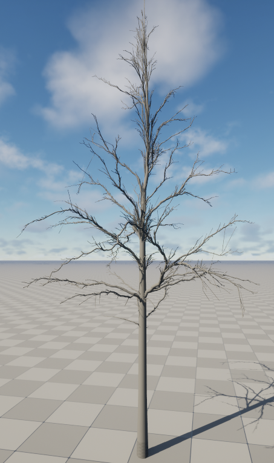
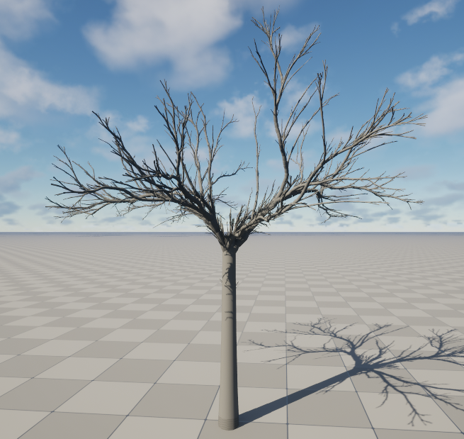
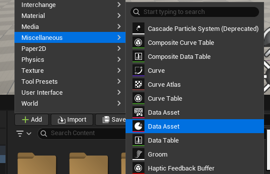
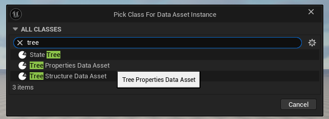
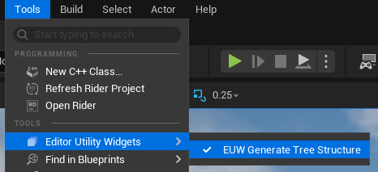
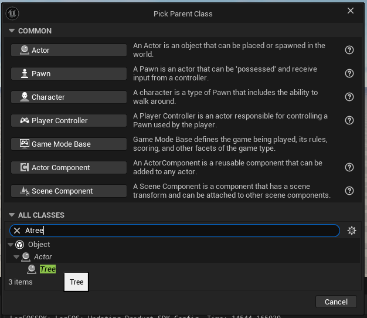
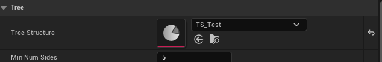

# WildFire Simulator

The goal of this project is to create a forest fire simulator in Unreal Engine 5.6 based on the [Fire in Paradise](https://dl.acm.org/doi/10.1145/3450626.3459954) research paper.

The implementation of this simulator will happen in 3 steps.

1. Implement a procedural tree generator.
2. Implement single tree combustion.
3. Implement Forest scale combustion.

## Step 1 : Tree Generator

As input the "Fire in Paradise" research paper calls for input a tree in the form of a skeletal graph (nodes and edges). With a quick Google search and AI prompt, I didn't find any generator that outputs a tree in this specific format. In the paper, they mentioned that they used a custom software made from different paper called [Synthetic Silviculture](https://dl.acm.org/doi/10.1145/3306346.3323039). I found the paper and two others that it builds on: [Space Colonization](https://algorithmicbotany.org/papers/colonization.egwnp2007.large.pdf) and [Self-organizing tree models](https://algorithmicbotany.org/papers/selforg.sig2009.pdf). My implementation is based on those 3 papers.

### Exemple results

|Exemple 1|Exemple 2|
|---------|---------|
|||

### Improvements and Optimizations

A lot of improvements could be made to these trees. first visually some material and shading could help with the look of the tree, also finding a way to get rid of the small branches bunching in the middle and top of the trees would make them less gnarly. More importantly the trees are also missing leaves. I tried some kind of implementation  but it was too demending perfomances-wise.

The biggest optimization to do is getting faster generation times. One way, mention in the "Space Colonization" paper, is to 3D Delaunay triangulation for the attraction points iterations.

### How to use

In the Unreal Engine editor you can open and play the level `Forest`, it contain a sample tree called `BP_ConiferLike`. You can also add to the level one of the other samples in the `Content->Samples` folder. 
If you want to create your own tree, follow these steps :

1. Right-clicking the inside the content browser or clicking the `+ Add` button and create a new Data Asset

2. Choose the class `Tree Properties Data Asset`.

3. Create another Data Asset of class `Tree Structure Data Asset`
4. Double click on the recently created `Tree Properties Data Asset`, change the tree properties and save the file.
5. In the tools menu, open the "Generate Tree Structure" editor widget. 

6. In the windows select your `Tree Properties Data Asset` and `Tree Structure Data Asset` then click the "Generate" button. The editor may freeze while the generation is ongoing depending on the number of attraction points set in the parameters. ~2000 points takes around 20 to 30 seconds.
7. Create a new blueprint of class `ATree`.

8. Open the blueprint by double clicking, then in the details panel select your recently created `Tree Structure Data Asset` in the `Tree Structure` property. Compile and save the blueprint. 

9. Add your new blueprint to the level and press play.

## Step 2 : Single Tree Combustion

Not implemented yet.
Will be based on the [Wood Combustion](https://repository.kaust.edu.sa/items/2352df7f-1b8c-4600-8458-43fafb2c411e) research paper

## Step 3 : Forest scale combustion

Not implemented yet.